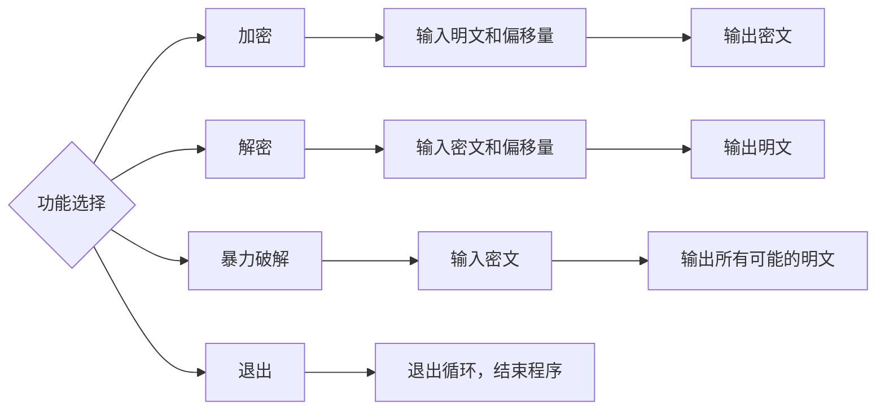

# **凯撒密码实现**

网安2402赵晗溆2241314507完成编写代码，录制视频，编写readme工作
网安2401程自牧2244215621完成注释，修改readme工作

## 一、项目简介

本项目是一个基于 Python 的凯撒密码加密/解密/暴力破解工具。凯撒密码是一种经典的替换密码，通过将字母表中的每个字母移动固定数量的位置来实现加密。程序支持用户选择加密、解密或暴力破解（尝试所有 0~25 的偏移量），适用于初学者理解密码学基础、Python 字符串处理及循环控制结构。

## 二、功能介绍

### **1. 加密功能**

用户输入明文和移位值（整数），程序将明文中的每个英文字母按指定偏移量移动，非字母字符保持不变，输出密文。

### **2. 解密功能**

用户输入密文和移位值，程序通过将移位值取反实现解密，还原原始明文。

### **3. 暴力破解功能**

用户输入密文后，程序自动尝试 0 到 25 的所有偏移量，依次输出每个偏移量对应的解密结果，帮助用户在没有密钥的情况下分析可能的明文。

### **4. 多次执行**

程序通过 while 循环实现连续运行，每次操作结束后询问用户是否继续，方便进行多组文本处理。

## 三、核心代码

```python
def caesar(text, shift):
    result = ""
    for char in text:
        if char.isupper():
            result += chr((ord(char) - ord('A') + shift) % 26 + ord('A'))
        elif char.islower():
            result += chr((ord(char) - ord('a') + shift) % 26 + ord('a'))
        else:
            result += char
    return result

def brute_force(ciphertext):
    for k in range(26):
        plain = caesar(ciphertext, -k)  # 解密使用负偏移
        print(f"偏移量 {k:2d}: {plain}")
```

## 四、流程图



## 五、演示视频

通过网盘分享的文件：测试视频.mp4
链接: https://pan.baidu.com/s/15MxAPAeVbX0DxysjL7bPgA?pwd=py01 提取码: py01

## 六、课程相关

1. **字符串格式化（f-string）**
   * print(f"偏移量 {k:2d}: {result}") 在暴力破解中格式化输出偏移量和结果。
2. **条件判断（if-elif-else）**
   * 判断用户选择：if choice == '3': ... else: ...
   * 判断字符类型：if char.isupper(): ... elif char.islower(): ... else: ...
3. **循环结构**
   * while True: 实现程序多次执行。
   * for k in range(26): 遍历0\~25偏移量。
   * for char in message: 遍历字符串每个字符。
4. **break语句**
   * if again.lower() != 'y': break 在用户选择退出时跳出循环。
5. **算术运算与取模（%）**
   * (ord(char) - ord('A') + shift) % 26 实现字母移位后的循环（保证结果在0\~25内）。
6. **range()函数**
   * range(26) 生成0到25的整数序列，用于暴力破解循环。

